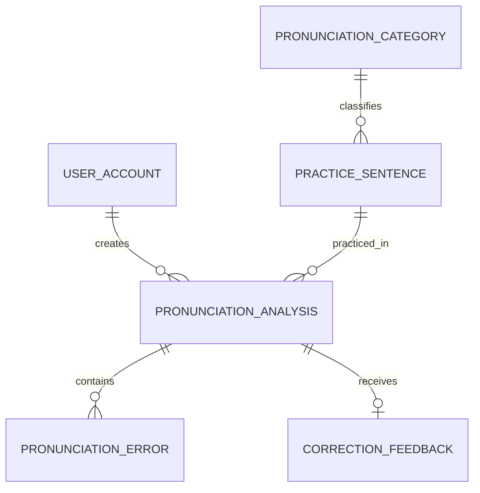

# 민중의 지팡이 백엔드

청각장애인을 위한 IPA 기반 발음 교정 서비스의 Django/MySQL 백엔드입니다. API 명세의 인증, 문장, 분석, 기록 및 통계 엔드포인트가 구현되어 있습니다.

## 데이터 모델



- `PronunciationCategory`: 받침, 연음, 비음화 등의 학습 분류
- `User`: 이메일을 로그인 ID로 사용하는 사용자
- `PracticeSentence`: 문장, G2P 목표 IPA 배열, 단어-음소 위치, 난이도
- `PronunciationAnalysis`: 사용자별 목표/인식 IPA, 정렬 결과, 점수, 분석기 버전
- `PronunciationError`: 삽입·삭제·대체·약화 오류의 음소 및 단어 위치
- `CorrectionFeedback`: LLM 교정 설명, 우선순위, 구조화 출력 및 검증 여부

원본 음성은 분석 완료 또는 실패 후 삭제합니다. 저장에 동의하지 않은 분석 결과는 30분 동안만 임시 보관하며 기록, 추천 및 통계에 포함하지 않습니다.

## API 공통 환경

- Django REST Framework
- SimpleJWT Access/Refresh 인증 및 Refresh Token 블랙리스트
- Celery와 Redis 비동기 작업
- drf-spectacular OpenAPI 및 Swagger UI
- 허용 Origin 기반 CORS
- Expo 웹의 `webm` 녹음 길이 검증을 위한 `ffprobe`(FFmpeg)

macOS에서는 `brew install ffmpeg`로 `ffprobe`를 설치할 수 있습니다.

개발 서버 실행 후 Swagger UI는 `/api/docs/`, OpenAPI 스키마는 `/api/schema/`에서 확인할 수 있습니다.

현재 `development_analyzer`는 프론트엔드 연동 확인을 위한 개발용 구현입니다. 실제 음성을 판정하지 않고 목표 IPA를 그대로 반환하므로 운영 및 시연 결과로 사용하면 안 됩니다. 실제 분석 함수가 준비되면 `.env`의 `PRONUNCIATION_ANALYZER_BACKEND`를 교체합니다.

## 로컬 설정

먼저 저장소 최상위에서 가상환경과 백엔드 환경변수를 준비합니다.

```bash
python3 -m venv .venv
.venv/bin/pip install -r backend/requirements.txt
cp backend/.env.example backend/.env
backend/scripts/start_mysql.sh
brew services start redis
```

이후 Django 명령은 `backend/`에서 실행합니다.

```bash
cd backend
```

MySQL에서 데이터베이스와 개발 계정을 생성합니다. 아래 비밀번호는 `.env`의 `MYSQL_PASSWORD`와 동일하게 지정합니다.

```sql
CREATE DATABASE jipangi CHARACTER SET utf8mb4 COLLATE utf8mb4_unicode_ci;
CREATE USER 'jipangi'@'localhost' IDENTIFIED BY '개발용-비밀번호';
CREATE USER 'jipangi'@'127.0.0.1' IDENTIFIED BY '개발용-비밀번호';
GRANT ALL PRIVILEGES ON jipangi.* TO 'jipangi'@'localhost';
GRANT ALL PRIVILEGES ON jipangi.* TO 'jipangi'@'127.0.0.1';
FLUSH PRIVILEGES;
```

스키마와 초기 발음 분류를 적용합니다.

```bash
../.venv/bin/python manage.py migrate
../.venv/bin/python manage.py loaddata initial_categories
```

관리자 화면이 필요하면 계정을 생성하고 `/admin/`으로 접속합니다.

```bash
../.venv/bin/python manage.py createsuperuser
../.venv/bin/python manage.py runserver
```

비동기 분석 작업을 처리할 Celery 워커는 별도 터미널에서 실행합니다.

```bash
../.venv/bin/celery -A config worker --loglevel=INFO
```

## 검증

외부 MySQL 실행 여부와 무관하게 모델 및 제약조건을 검증할 수 있습니다.

```bash
../.venv/bin/python manage.py check
../.venv/bin/python manage.py makemigrations --check --dry-run
../.venv/bin/python manage.py test --settings=config.settings_test
```

## 현재 로컬 서비스

- MySQL 8.4: `127.0.0.1:3307`
- Redis: `127.0.0.1:6379`

접속 정보와 서명 키는 `.env`에서 관리하며 저장소에 커밋하지 않습니다.
`backend/`에서 MySQL 종료가 필요하면 `scripts/stop_mysql.sh`를 실행합니다.
