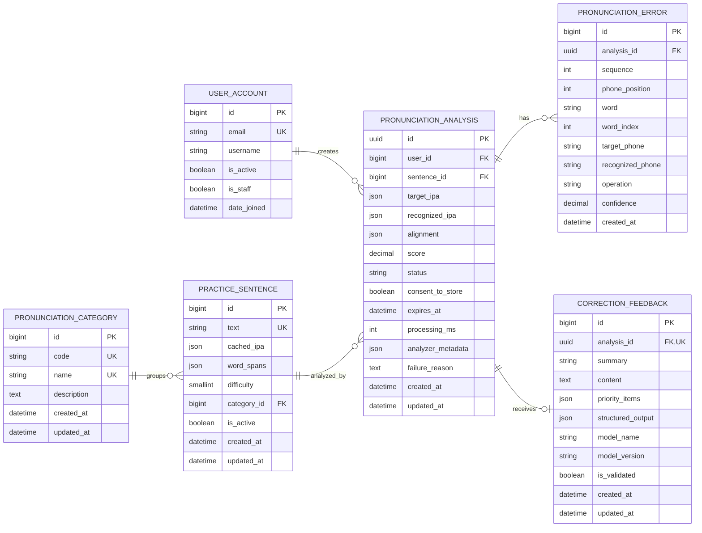

# Database ERD

프로젝트 데이터베이스 구조는 이메일 로그인을 사용하는 사용자 테이블(`user_account`)과 발음 분석 도메인 테이블 5개로 구성된다.

## Relationship Summary

- `user_account` 1:N `pronunciation_analysis`
- `pronunciation_category` 1:N `practice_sentence`
- `practice_sentence` 1:N `pronunciation_analysis`
- `pronunciation_analysis` 1:N `pronunciation_error`
- `pronunciation_analysis` 1:0..1 `correction_feedback`

## How To View

1. VS Code에서 이 파일을 연다.
2. 확장 프로그램 `Markdown Preview Mermaid Support`를 설치한다.
3. `Command + Shift + V`로 Markdown Preview를 연다.

GitHub에 올리면 Mermaid 코드 블록이 자동으로 ERD로 렌더링된다.

대안으로 https://mermaid.live 에 위 Mermaid 코드 블록을 붙여넣어 바로 볼 수 있다.
