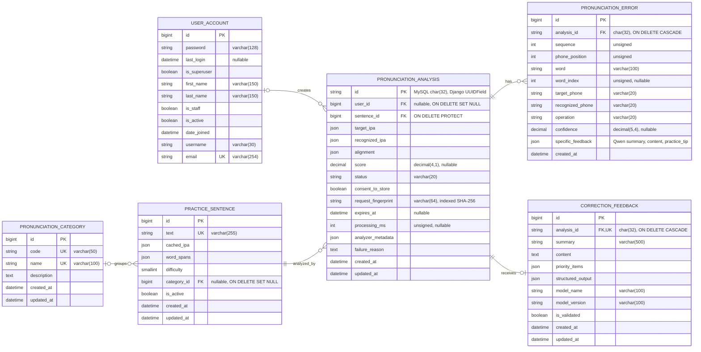

# Database ERD

이 ERD는 이메일 로그인을 사용하는 사용자 테이블(`user_account`)과 발음 분석
도메인 테이블 5개를 표시한다. Django가 자동 생성하는 관리자, 세션, 권한, JWT
블랙리스트 테이블과 사용자-권한 중간 테이블은 핵심 도메인 ERD에서 제외했다.

## Relationship Summary

- `user_account` 0..1:N `pronunciation_analysis`: 사용자가 삭제되면 분석의
  `user_id`는 `NULL`로 변경된다.
- `pronunciation_category` 0..1:N `practice_sentence`: 카테고리가 삭제되면
  문장의 `category_id`는 `NULL`로 변경된다.
- `practice_sentence` 1:N `pronunciation_analysis`
- `pronunciation_analysis` 1:N `pronunciation_error`
- `pronunciation_analysis` 1:0..1 `correction_feedback`

## 주요 제약조건

- `user_account.email`, `pronunciation_category.code`,
  `pronunciation_category.name`, `practice_sentence.text`는 각각 고유값이다.
- `practice_sentence.difficulty`는 `1`, `2`, `3`만 허용한다.
- `pronunciation_analysis.status`는 `pending`, `processing`, `completed`,
  `failed`만 허용한다.
- `pronunciation_analysis.score`는 `NULL` 또는 `0.0` 이상 `100.0` 이하이다.
- `pronunciation_analysis.request_fingerprint`는
  `UTF-8(user_id) + 0x00 + UTF-8(sentence_id) + 0x00 + 음성 바이트` 순서로
  결합해 계산한 64자리 SHA-256 값이다. 기존 데이터는 빈 문자열이며 이후
  생성되는 분석부터 값이 저장된다.
- `pronunciation_error`의 `(analysis_id, sequence)` 조합은 고유값이다.
- `pronunciation_error.confidence`는 `NULL` 또는 `0.0` 이상 `1.0` 이하이다.
- `pronunciation_error.specific_feedback`에는 오류별 Qwen 응답의 `summary`,
  `content`, `practice_tip`을 JSON 객체로 저장하며 생성 전 기본값은 `{}`이다.
- 분석이 삭제되면 연결된 발음 오류와 교정 피드백도 함께 삭제된다.
- 사용 중인 연습 문장은 연결된 분석이 남아 있는 동안 삭제할 수 없다.

## 주요 인덱스

- `practice_sentence`: `(is_active, difficulty)`, `(category_id, is_active)`
- `pronunciation_analysis`: `(user_id, created_at)`,
  `(sentence_id, created_at)`, `(status, created_at)`, `expires_at`,
  `request_fingerprint`
- `pronunciation_error`: `(analysis_id, operation)`,
  `(target_phone, recognized_phone)`

## MySQL 표기 참고

- Django `UUIDField`는 현재 MySQL에서 하이픈 없는 `char(32)`로 저장된다.
- Django `BooleanField`는 MySQL에서 `tinyint(1)`로 저장된다.
- `TextField`는 MySQL에서 `longtext`, `DateTimeField`는 `datetime(6)`로
  저장된다.
- ERD의 `string`, `boolean`, `datetime` 등은 가독성을 위한 논리 자료형이며,
  따옴표 안에 실제 MySQL 자료형이나 nullable 여부를 표시했다.

## How To View

1. VS Code에서 이 파일을 연다.
2. 확장 프로그램 `Markdown Preview Mermaid Support`를 설치한다.
3. `Command + Shift + V`로 Markdown Preview를 연다.

GitHub에 올리면 Mermaid 코드 블록이 자동으로 ERD로 렌더링된다.

대안으로 https://mermaid.live 에 위 Mermaid 코드 블록을 붙여넣어 바로 볼 수 있다.
